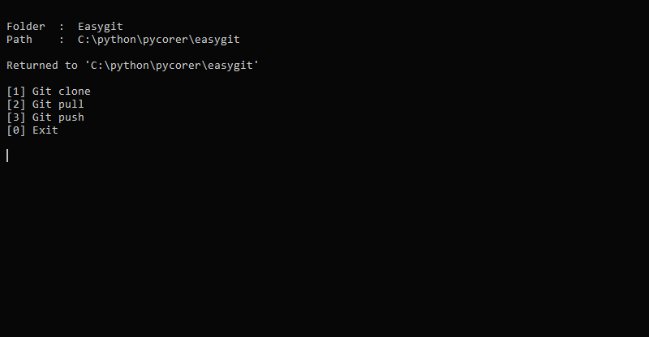

# EasyGit

Python CLI to make it easier to work with Git



## Features

- Keyboard navigation with arrow keys (left, right).
- Automatically push your local files into your GitHub repository.
- Ready template for your cloned repository :
   - README.md
   - CONTRIBUTING.md
   - .gitignore
   - .vscode (for disable git in vscode)

## Installation

1. Clone the repository or download it:

   ```shell
   git clone https://github.com/pycorer/easygit
   ```

2. Navigate to the project directory:

   ```shell
   cd easygit
   ```

3. Build .exe file

   ```shell
   pyinstaller --onefile main.py
   ```

## How to Use:

### 1. Use the executable file 

Copy the `main.exe` file and paste it into your main directory.

### 2. Maximize Your Productivity

## Getting Help

If you have any questions or need assistance, feel free to [open an issue](https://github.com/pycorer/easygit/issues).

## Contributing

If you have an idea for a new prompt or want to improve existing ones, check out [contributing.md](CONTRIBUTING.md) for more information.

## Support

If you find this project helpful, show your support by starring the repository.