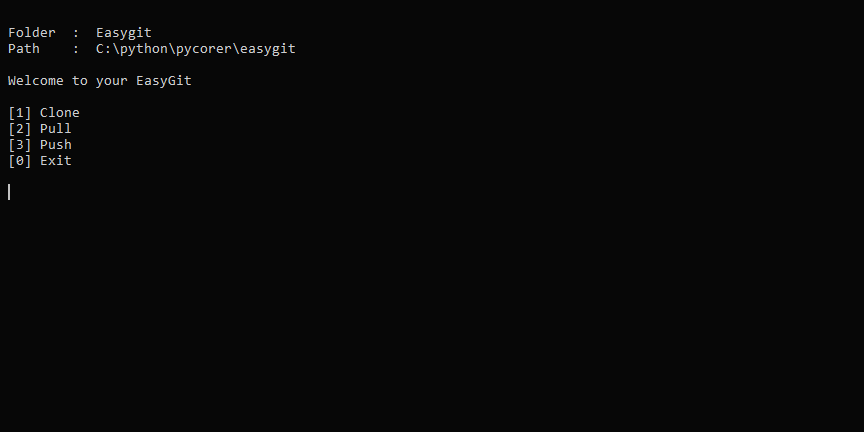

# EasyGit

Python CLI tool that simplifies Git tasks, making it easier to manage your Github repositories.



## Features

- **Keyboard Navigation :** Navigate easily using arrow keys (left, right).
- **Automatic Push :** Automatically push your local files to your GitHub repository.
- **Ready-to-Use Templates :** Cloned repositories come with pre-set templates:
  - README.md
  - LICENSE (default : MIT)
  - CONTRIBUTING.md
  - .gitignore
  - .vscode (to disable Git in VSCode)

## Installation

1. Clone the repository or download it:

   ```shell
   git clone https://github.com/pycorer/easygit
   ```

2. Navigate to the project directory:

   ```shell
   cd easygit
   ```

3. Build the .exe file:

   ```shell
   pyinstaller --onefile --icon=icon.ico --name=easygit main.py
   ```

## How to Use:

1. **Executable File:**
   - Copy the `easygit.exe` file and paste it into your main directory.

2. **Keyboard Control:**
   - Press enter to open the current folder in VSCode
   - Press the space key to update.
   - Utilize the arrow keys (left, right) to navigate between folders.

3. **Boost Your Productivity:**
   - Maximize your efficiency with this tool.

## Getting Help

If you have any questions or need assistance, feel free to [open an issue](https://github.com/pycorer/easygit/issues).

## Contributing

If you have an idea for a new feature or want to improve existing ones, check out [CONTRIBUTING.md](CONTRIBUTING.md) for more information.

## Support

If you find this project helpful, show your support by starring the repository.